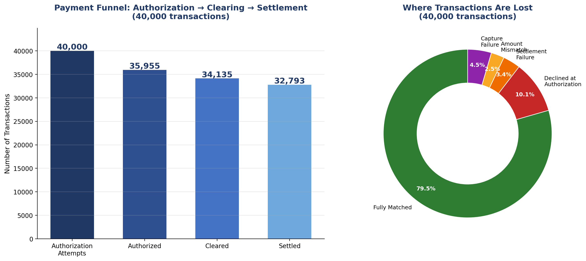

# Payment Funnel Analysis — Authorization → Clearing → Settlement

SQL-based analysis of 40,000 simulated payment transactions, tracing each transaction through the three-stage payments lifecycle (Authorization → Clearing → Settlement) and identifying exactly where and why transactions fail along the way.

## Why this project

In real payments operations, "approved" doesn't mean "money moved." A transaction can be authorized, then still fail to clear, fail to settle, or settle for the wrong amount. This project builds a full classification and analysis pipeline that mirrors how a payments/reconciliation analyst would actually investigate a funnel drop-off in production.

## Dataset

- **40,000 simulated transactions** across 4 card networks (Visa, Mastercard, RuPay, Amex) and 20 merchants
- Each transaction carries realistic failure patterns at every stage:
  - **Authorization**: ~10% decline rate (insufficient funds, expired card, invalid card, exceeds limit, do not honor)
  - **Clearing**: ~5% of approved transactions fail to clear (capture failure)
  - **Settlement**: ~4% of cleared transactions fail to settle, and ~3% settle with an amount mismatch
- This is a **synthetic dataset**, built to mirror realistic payments funnel behavior — not real transaction data.

## Results

| Stage | Count | Conversion Rate |
|---|---|---|
| Authorization Attempts | 40,000 | — |
| Authorized | 35,955 | 89.9% |
| Cleared | 34,135 | 94.9% of authorized |
| Settled | 32,793 | 96.1% of cleared |

**Where transactions are lost:**

| Status | Count | % |
|---|---|---|
| Fully Matched | 31,782 | 79.5% |
| Declined at Authorization | 4,045 | 10.1% |
| Capture Failure | 1,820 | 4.5% |
| Settlement Failure | 1,342 | 3.4% |
| Amount Mismatch | 1,011 | 2.5% |



**Total value lost at each stage (simulated AED):**
- Lost at Authorization: 10,192,930.73
- Lost at Clearing: 4,729,883.80
- Lost at Settlement: 3,379,544.94
- Lost to Amount Mismatches: 26,504.04

## How to run this yourself

1. Run `setup_40k.sql` in MySQL — it creates the database and table, then bulk-loads `funnel_data_40k.csv` using `LOAD DATA LOCAL INFILE`.
2. Run the queries in `analysis_queries.sql` one at a time — each is labeled with what it shows (funnel counts, conversion rates, failure classification, decline reasons, network performance, daily trend, value lost, merchant-level breakdown).

## Files in this repository

| File | Purpose |
|---|---|
| `funnel_data_40k.csv` | The 40,000-row transaction dataset |
| `setup_40k.sql` | Database/table creation + bulk CSV import script |
| `analysis_queries.sql` | 8 analysis queries — funnel classification, decline breakdown, network/merchant performance, value lost |
| `funnel_chart_40k.png` | Funnel + failure-breakdown visualization |

## Core SQL logic

The heart of this project is a `CASE WHEN` classification, applying reconciliation logic across three joined data points per transaction:

```sql
CASE
    WHEN auth_status = 'Declined' THEN 'Declined at Authorization'
    WHEN clearing_status = 'Not Cleared' THEN 'Capture Failure'
    WHEN settlement_status = 'Not Settled' THEN 'Settlement Failure'
    WHEN settlement_amount IS NOT NULL AND settlement_amount <> auth_amount THEN 'Amount Mismatch'
    ELSE 'Fully Matched'
END AS status
```

## Skills demonstrated

SQL (CASE WHEN classification, aggregation, GROUP BY, conversion-rate calculation), bulk data loading (`LOAD DATA LOCAL INFILE`), payments domain knowledge (Authorization/Clearing/Settlement lifecycle, decline codes, capture failures), and data visualization.

---

*Built by [Pratyaksh Singh](https://linkedin.com/in/pratyaksh-singh-833309202) — Payments & Banking Operations professional.*
